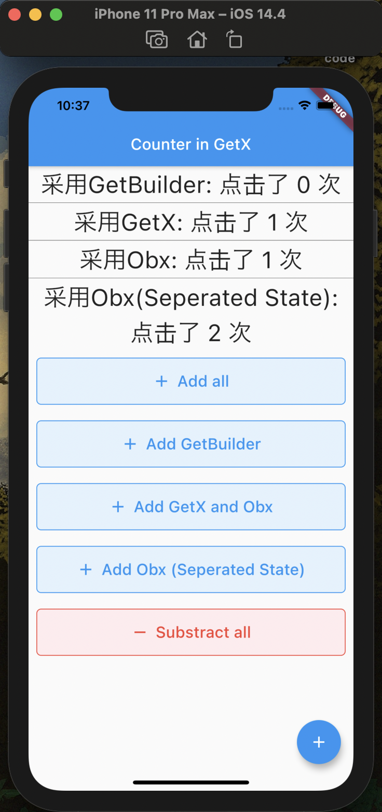

# A Flutter Counter Project using GetX
See flutter package

[GetX pub.dev](https://pub.dev/packages/get)

[GetX GitHub](https://github.com/jonataslaw/getx)

## Learning GetX with simple flutter counter project

Here is an easy implementation of counter project using GetX, with
- using GetBuilder, GetX, Obx to display different counter in one page
- SIMPLE! there are only 3 .dart file, one for View(UI), one for Controller(GetX) and one for the separated state(better management for state)
- console log for understanding when widget build
  - you can add print() in the flutter demo project(which using setState()) to see when click floating button, which widget will be rebuild (it rebuild the whole HomePage, that cost a lot)

You might have seen the flutter demo project, the counter project.
